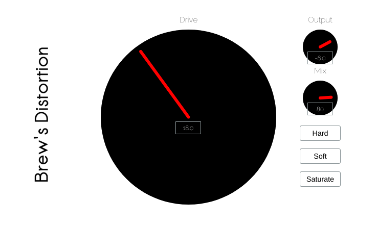

# Brew's Distortion

A simple distortion plugin with three distinct modes: Hard, Soft, and Saturate.



## Build and Compile with Git Submodules
If JUCE is not installed on your system and you don't want to mess around with the CMakeLists.txt, clone this repo with the `git clone --recurse-submodule https://github.com/RoastedAlmond4600/BrewsDistortion.git` command, `cd` into the cloned directory
and then run
```
cmake -B cmake-build
```
This will create a build directory cmake-build, which will allow you to properly build it using
```
cmake --build cmake-build
```
Find the final executables within `cmake-build/BrewsDist_artefacts`
## Build and Compile with Global JUCE path
If you already have JUCE installed on your system, navigate to it and set it up as so
```
cd /path/to/clone/JUCE
cmake -B cmake-build-install -DCMAKE_INSTALL_PREFIX=/path/to/JUCE/install
cmake --build cmake-build-install --target install
```
Then in the directory you cloned this repo,
```
cd /path/to/my/project
```
Uncomment find_package(JUCE REQUIRED) and comment out add_subdirectory below it
```
find_package(JUCE REQUIRED)
# add_subdirectory(modules/JUCE)
```
Finally, generate the build directory with the specific flag and build it as usual 
```
cmake -B cmake-build -DCMAKE_PREFIX_PATH=/path/to/JUCE/install
cmake --build cmake-build
```
Find the final executables within `cmake-build/BrewsDist_artefacts`


